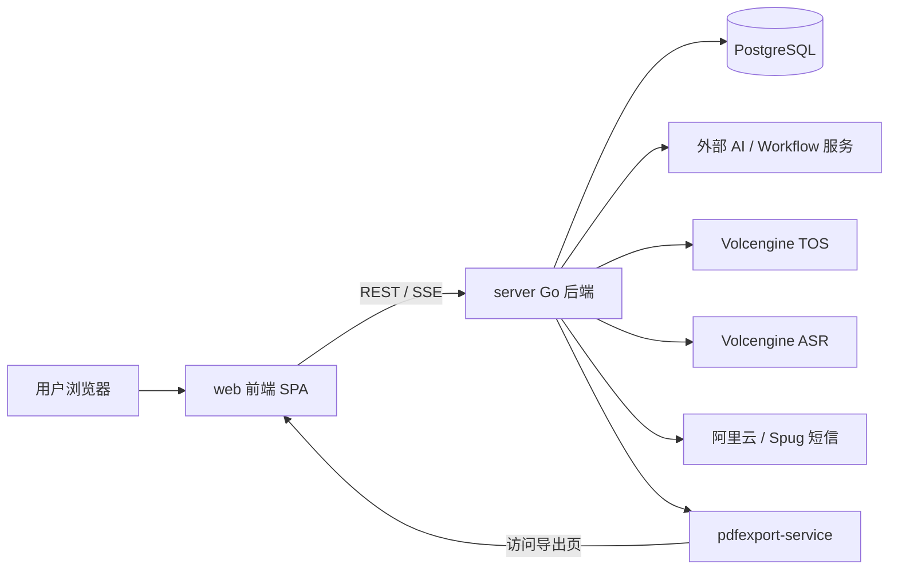
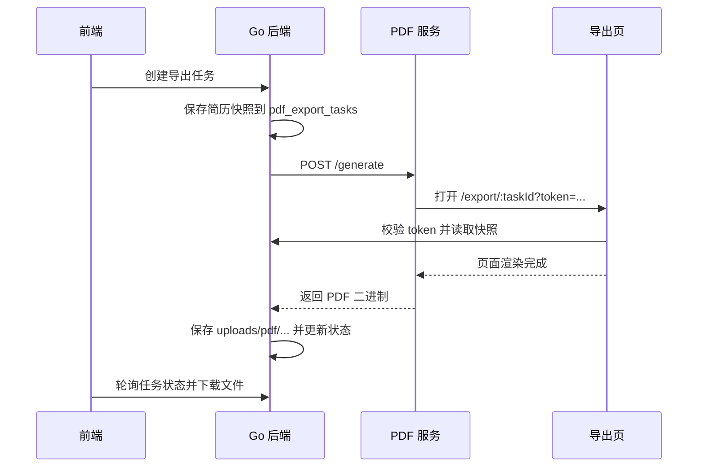

# 项目架构文档

## 1. 项目概览

`resume-polisher` 是一个围绕简历优化、工作流执行、面试复盘和 PDF 导出的单仓库项目，整体由以下三部分组成：

1. `server/`：Go 单体后端，负责 API、鉴权、业务编排、数据库访问、静态资源托管和外部服务对接。
2. `web/`：React 单页前端，负责用户交互、编辑器、管理后台、面试复盘和导出页渲染。
3. `pdfexport-service/`：独立 Node 服务，基于 Puppeteer 访问前端导出页并生成 PDF。

整体运行形态可以概括为：

- 前端在开发时由 Vite 提供本地开发服务，`/api` 请求代理到后端。
- 生产时前端构建产物由 Go 后端静态托管，前后端通常同域部署。
- AI 工作流、对象存储、语音识别、短信、PDF 渲染等能力通过后端统一接入。

## 2. 仓库结构

### 2.1 顶层目录

- `server/`：后端源码
- `web/`：前端源码
- `pdfexport-service/`：PDF 生成服务
- `docs/`：项目文档
- `openspec/`：需求变更、设计和实现记录
- `scripts/`：辅助脚本和历史迁移脚本

### 2.2 运行时角色

- `server/main.go`：后端启动入口
- `web/src/main.tsx`：前端入口
- `pdfexport-service/src/server.js`：PDF 服务入口

## 3. 总体架构

### 3.1 系统分层

后端采用比较典型的单体分层结构：

`router -> api -> service -> model/database -> external integrations`

前端采用单页应用结构：

`router -> pages -> components -> api/store/utils`

### 3.2 核心业务域

项目当前主要业务域包括：

- 用户与认证
- 简历上传、解析、结构化、编辑和版本管理
- 工作流配置与执行
- 对话与聊天消息
- PDF 导出
- 面试复盘
- 邀请码体系
- 计费/套餐
- 站点变量和管理后台
- 事件日志与系统统计

### 3.3 架构特点

- 单体式系统，没有拆分成多个独立业务微服务。
- 后端直接使用 GORM 访问 PostgreSQL，没有单独的 repository/dao 层。
- 大量业务状态使用 `jsonb` 承载，兼顾结构化查询和灵活扩展。
- 异步任务主要基于数据库任务表 + goroutine + 前端轮询/SSE，而不是消息队列。
- 后端既是 API 服务，也是前端静态资源服务。

## 4. 后端架构

### 4.1 启动流程

后端启动入口在 `server/main.go`，初始化顺序为：

1. 加载配置
2. 初始化日志
3. 初始化进程内缓存
4. 初始化数据库
5. 初始化全局服务
6. 初始化 Gin 路由
7. 启动 HTTP 服务

关键初始化目录：

- `server/initialize/config.go`
- `server/initialize/db.go`
- `server/initialize/cache.go`
- `server/initialize/service.go`
- `server/initialize/router.go`

### 4.2 目录分层

- `server/router/`：路由注册层
- `server/api/`：HTTP Handler 层
- `server/service/`：业务服务层
- `server/model/`：GORM 模型
- `server/middleware/`：JWT、管理员鉴权、CORS
- `server/global/`：全局单例、缓存、服务接口
- `server/utils/`：日志、JWT、响应、短信、文件等工具
- `server/config/`：配置结构定义

### 4.3 路由与鉴权

后端通过 `server/router/enter.go` 将路由分为三类：

- `PublicGroup`：公开接口
- `PrivateGroup`：需要 `JWTAuth()`
- `AdminGroup`：需要 `JWTAuth() + AdminAuth()`

主要路由模块包括：

- `user`
- `workflow`
- `conversation`
- `chat_message`
- `resume`
- `file`
- `invitation`
- `sitevariable`
- `eventlog`
- `billing`
- `tos`
- `asr`
- `interview`
- `system`

鉴权机制：

- 使用 Bearer Token + JWT
- 解析后将 `userID`、`username`、`userRole` 注入 Gin Context
- 管理员角色值为 `888`

### 4.4 HTTP 层职责

`server/api/` 主要负责：

- 绑定参数
- 读取用户上下文
- 调用 service
- 输出统一响应结构

这一层保持较薄，复杂业务逻辑主要放在 `server/service/`。

### 4.5 Service 层职责

`server/service/` 是业务编排核心，直接连接：

- `global.DB`
- 全局外部服务实例
- 本地文件系统
- 外部 AI/存储/ASR/PDF 服务

重点服务模块：

- `service/user`
- `service/resume`
- `service/app`
- `service/file`
- `service/interview`
- `service/billing`
- `service/sitevariable`
- `service/tos`
- `service/asr`
- `service/pdfexport`

### 4.6 静态资源与 SPA 回退

`server/initialize/router.go` 中，后端会：

- 托管 `web/dist` 下的静态资源
- 对非 `/api` 请求回退到 `index.html`

这说明生产环境下的推荐形态是由后端统一承载前端 SPA。

## 5. 前端架构

### 5.1 技术栈

前端位于 `web/`，当前可确认的栈如下：

- React 19
- TypeScript
- Vite 7
- React Router
- Zustand
- Axios
- Tailwind CSS 4
- Radix UI / `react-icons` / `lucide-react`

### 5.2 前端目录

- `web/src/router/`：路由配置
- `web/src/pages/`：页面级业务模块
- `web/src/components/`：通用组件、布局和业务组件
- `web/src/api/`：API 封装
- `web/src/store/`：状态管理
- `web/src/hooks/`：自定义 Hooks
- `web/src/utils/`：工具函数
- `web/src/types/`：类型定义

### 5.3 路由结构

前端使用 `createBrowserRouter` 定义集中式路由，路由级组件基本通过 `lazy()` 懒加载。

主要页面包括：

- 首页和认证页
- 简历上传和简历列表
- 核心编辑器页
- 个人中心
- 管理后台
- 面试复盘
- 导出渲染页

其中 `/export/:taskId` 是一个独立渲染页，专门为 PDF 服务生成页面快照。

### 5.4 状态管理

当前全局状态主要由 Zustand 管理：

- `authStore`：登录态、用户信息、鉴权校验
- `globalStore`：全局 UI 状态
- `toastStore`：消息通知
- `workflowStore`：工作流列表和执行态

鉴权特征：

- Token 保存在 `localStorage`
- 应用启动时执行 `checkAuth()`
- Axios 请求拦截器自动注入 `Authorization`
- 响应拦截器处理 `401`

### 5.5 前端 API 层

前端通过 `web/src/api/client.ts` 统一封装 API 调用，主要特征：

- 基于 Axios
- 统一使用相对路径 `/api/...`
- 自动附带 token
- 统一处理后端返回结构 `{ code, data, msg }`

特殊链路：

- 工作流流式执行使用 `fetch + SSE`
- TOS 上传使用预签名 URL 直传
- PDF 导出采用“创建任务 + 轮询状态”模式

### 5.6 核心页面职责

- `resume/*`：简历上传、历史记录、版本视图
- `editor/*`：核心简历编辑、工作流执行、版本切换、导出
- `interview/*`：音频上传、ASR、文本修订、分析结果展示
- `admin/*`：工作流、用户、站点变量、计费等后台管理

## 6. 外部工作流与第三方服务

项目对外部能力的接入主要集中在后端，由后端统一管理密钥、调用和结果落库。

### 6.1 AI / Workflow 平台

工作流配置中心使用 `workflows` 表保存：

- `api_url`
- `api_key`
- 输入输出定义
- 是否公开
- 启用状态

后端通过 `server/service/app/app_service.go` 执行工作流，支持：

- 普通阻塞式 HTTP 调用
- SSE 流式调用
- ChatFlow/Dify 风格接口兼容

典型用途：

- 文档提取
- 简历结构化
- 面试分析
- 编辑器中的 AI 工作流调用

### 6.2 文件上传与外部 AI 文件引用

文件服务存在两条路径：

1. 保存到后端本地文件系统
2. 按需再转发到外部 AI 平台，并保存外部文件 ID，例如 `dify_id`

这使得工作流可以复用上传后的远端文件，而不是始终直接传本地内容。

### 6.3 TOS 对象存储

TOS 主要用于文件直传和临时下载：

- 后端签发 STS 临时凭证
- 后端生成上传/下载预签名 URL
- 前端直接 PUT 到对象存储
- 完成后通知后端记录上传结果

主要用于面试音频上传等场景。

### 6.4 ASR 语音识别

ASR 接入的是火山引擎开放接口：

- 提交识别任务到外部 ASR API
- 本地创建 `asr_tasks` 任务记录
- 后端异步提交
- 前端/接口通过轮询查询状态并回写数据库

该链路没有引入独立消息队列，而是使用“数据库任务表 + 外部轮询”。

### 6.5 短信服务

短信能力主要用于登录/注册验证码，当前可确认集成：

- 阿里云短信
- Spug 短信

验证码和部分限流能力依赖进程内缓存实现。

### 6.6 PDF 导出服务

PDF 导出由三个角色协作完成：

1. 前端导出页 `web/src/pages/export/ResumeExportView.tsx`
2. 后端导出任务服务 `server/service/pdfexport`
3. Node/Puppeteer 服务 `pdfexport-service/`

流程如下：

1. 前端请求创建导出任务
2. 后端保存简历数据快照到 `pdf_export_tasks`
3. 后端异步调用 Node 服务 `/generate`
4. Node 服务访问 `render_base_url/export/:taskId?token=...`
5. 前端导出页渲染静态简历内容
6. Puppeteer 生成 PDF
7. 后端保存 PDF 到本地目录，并更新任务状态

## 7. 数据库架构

### 7.1 技术选型

- 数据库：PostgreSQL
- ORM：GORM
- 迁移策略：应用启动时 `AutoMigrate`

当前没有发现独立的 SQL migration 框架，数据库结构变更主要依赖：

- GORM `AutoMigrate`
- 零散脚本
- 文档化修复步骤

### 7.2 数据访问方式

项目中的数据访问较直接：

- 全局数据库句柄保存在 `global.DB`
- service 层直接调用 GORM
- 关键业务使用事务和少量行级锁

在扣费、ASR 状态同步等场景中，能看到事务或 `FOR UPDATE` 的使用。

### 7.3 建模特点

数据库采用“关系表 + JSONB 承载半结构化业务状态”的混合方案。

高频 JSONB 字段示例：

- `resume_records.structured_data`
- `resume_records.pending_content`
- `resume_records.metadata`
- `workflow_executions.inputs`
- `workflow_executions.outputs`
- `interview_reviews.data`
- `interview_reviews.metadata`
- `user_event_logs.details`

这种设计适合 AI 输出和流程状态多变的业务场景，但也意味着：

- 结构约束更多依赖代码而不是数据库 schema
- JSON 字段演进需要更谨慎的兼容处理

### 7.4 核心表

按业务域划分，核心表包括：

#### 用户与认证

- `users`
- `user_profiles`

#### 简历与文件

- `files`
- `resume_records`
- `pdf_export_tasks`

#### 工作流与消息

- `workflows`
- `workflow_executions`
- `conversations`
- `chat_messages`

#### 面试复盘

- `asr_tasks`
- `interview_reviews`
- `tos_uploads`

#### 业务运营

- `invitation_codes`
- `invitation_uses`
- `site_variables`
- `user_event_logs`

#### 计费

- `billing_packages`
- `billing_action_prices`
- `user_billing_packages`

### 7.5 数据库与代码映射

主要模型文件包括：

- `server/model/user.go`
- `server/model/user_profile.go`
- `server/model/file.go`
- `server/model/resume.go`
- `server/model/workflows.go`
- `server/model/conversation.go`
- `server/model/chat_message.go`
- `server/model/asr_task.go`
- `server/model/interview_review.go`
- `server/model/tos_upload.go`
- `server/model/pdf_export_task.go`
- `server/model/event_log.go`
- `server/model/billing_*.go`
- `server/model/invitation_*.go`
- `server/model/site_variable.go`

## 8. 关键业务流程

### 8.1 简历处理流程

1. 用户上传文件或创建纯文本简历
2. 后端保存文件记录和简历记录
3. 如需要，文件转发到外部工作流平台
4. 后端调用文档提取/结构化工作流
5. 结果写入 `resume_records`
6. 前端编辑器基于结构化数据继续优化和保存版本

### 8.2 工作流执行流程

1. 前端选择工作流并提交参数
2. 后端从 `workflows` 表读取配置
3. 后端向外部工作流平台发起请求
4. 同步返回或以 SSE 方式流式转发
5. 执行日志写入 `workflow_executions`

### 8.3 面试复盘流程

1. 前端向后端申请 TOS 上传能力
2. 前端直传音频到 TOS
3. 后端创建 `interview_reviews`
4. 后端生成音频下载地址并提交 ASR
5. 状态保存在 `asr_tasks` 和 `interview_reviews.metadata`
6. 用户确认或编辑转写文本
7. 后端触发面试分析工作流
8. AI 结果写入 `interview_reviews.data`

## 9. 部署与运行关系

### 9.1 开发环境

- 前端：Vite 本地开发
- 后端：Gin API 服务
- PDF：本地 Node 服务
- 数据库：本地或远程 PostgreSQL

开发联调特征：

- 前端走 `/api`
- Vite 代理到后端
- PDF 服务单独监听端口

### 9.2 生产环境

推荐理解为“三段式”：

1. 前端构建为静态资源
2. 后端托管静态资源并提供 API
3. PDF 服务作为独立辅助进程运行

## 10. 当前架构的边界与注意点

以下是当前实现中比较重要的架构事实：

- 没有发现 Redis、Kafka、RabbitMQ、Cron 框架或独立任务队列。
- 短信验证码限流和缓存基于进程内缓存，多实例部署时需要额外关注一致性。
- 数据迁移以 `AutoMigrate` 为主，适合迭代期，但复杂 schema 变更需要更严格流程。
- 外部工作流平台是核心能力承载点，业务能力较依赖配置和第三方可用性。
- PDF 导出强依赖导出页渲染稳定性和 Puppeteer 运行环境。

## 11. 架构总结

这个项目本质上是一个“Go 单体业务中台 + React SPA 前端 + 若干外部 AI/云服务”的应用：

- Go 后端负责统一鉴权、数据管理、业务编排和第三方服务整合
- React 前端负责复杂交互和编辑体验
- PostgreSQL 承载核心关系数据和大量 JSONB 业务状态
- AI 工作流、ASR、对象存储和 PDF 渲染构成外部能力层

如果从维护视角理解，这个项目最关键的四条主线是：

1. `简历链路`：上传 -> 提取 -> 结构化 -> 编辑 -> 导出
2. `工作流链路`：配置 -> 执行 -> 流式返回 -> 结果落库
3. `面试链路`：音频上传 -> ASR -> 文本修订 -> AI 分析
4. `运营链路`：认证 -> 邀请码 -> 计费 -> 日志 -> 后台配置
