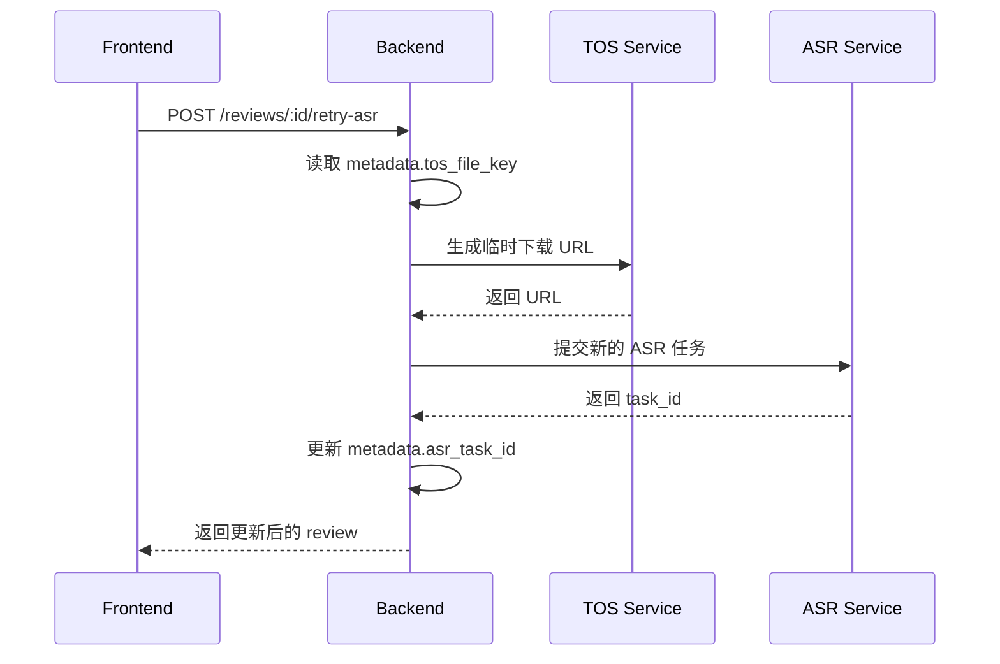

# Design: 重构面试复盘创建流程

## Context

当前面试复盘功能在测试页面可以正常使用 ASR，但在正式的面试复盘创建流程中会报错：
```
ASR error: status=45000000, message=[Client-side generic error] OperatorWrapper Process failed: cannot find task
```

根本原因是当前设计将面试复盘记录的创建绑定到 ASR 任务完成，导致：
1. ASR 任务 ID 作为主要标识符，但 ASR 服务不稳定
2. TOS 文件的临时 URL 过期后无法重新获取
3. 没有存储原始文件信息，无法重试

**Stakeholders:**
- 用户：需要可靠的面试复盘功能，支持失败重试
- 后端：需要稳定的数据模型，支持异步处理
- 前端：需要清晰的状态管理和错误恢复机制

## Goals / Non-Goals

### Goals
- ✅ TOS 上传完成后立即创建面试复盘记录
- ✅ 在 metadata 中存储 TOS file key，支持按需生成临时 URL
- ✅ ASR 失败后可以重试（使用存储的 file key 生成新 URL）
- ✅ 解耦文件上传、ASR 识别、AI 分析三个阶段
- ✅ 支持页面刷新后继续未完成的流程

### Non-Goals
- ❌ 向后兼容旧的面试复盘记录
- ❌ 支持多音频文件
- ❌ ASR 任务独立管理（仍嵌入面试复盘流程）

## Decisions

### Decision 1: 在 TOS 上传后立即创建 Review 记录

**Choice:** Step 1 完成上传后调用 `createReview` API 创建记录

**Rationale:**
- 用户已投入时间上传文件，应尽早持久化
- 后续步骤可以基于已有记录进行更新
- 页面刷新后可以恢复进度

**Implementation:**
```typescript
// Step 1: 上传完成后
const uploadResult = await tosAPI.uploadToTOS(file);
const review = await interviewAPI.createReview({
  tos_file_key: uploadResult.key,
  audio_filename: file.name,
});
// 更新 URL，导航到 ?id=xxx
navigate(`/interview/reviews?id=${review.id}`, { replace: true });
```

**Alternatives Considered:**
- 等 ASR 完成再创建记录：当前方案，问题已说明
- 使用 localStorage 暂存：不可靠，跨设备不同步

### Decision 2: metadata 结构设计

**Choice:** 使用 `tos_file_key` 存储文件标识，`asr_task_id` 存储 ASR 任务 ID

**New Metadata Structure:**
```json
{
  "tos_file_key": "audio/interview/uuid.mp3",
  "audio_filename": "面试录音.mp3",
  "asr_task_id": "uuid-of-asr-task",
  "asr_result": { "text": "...", "segments": [...] },
  "status": "pending|transcribing|analyzing|completed|failed",
  "error_message": "错误信息",
  "job_position": "前端工程师",
  "target_company": "字节跳动"
}
```

**Field Responsibilities:**
- `tos_file_key`: 永久存储，用于生成临时 URL
- `asr_task_id`: ASR 任务追踪，可能随重试变化
- `asr_result`: ASR 完成后缓存结果
- `status`: 当前处理阶段

**Alternatives Considered:**
- 复用 `main_audio_id` 字段：语义不清晰，易混淆

### Decision 3: ASR 重试机制

**Choice:** 新增 `POST /api/interview/reviews/:id/retry-asr` 端点

**Rationale:**
- 专门处理 ASR 重试逻辑
- 自动使用存储的 `tos_file_key` 生成新 URL
- 可以创建新的 ASR task 或复用旧 task（取决于状态）

**Implementation Flow:**


**Alternatives Considered:**
- 前端直接调用 TOS API 获取 URL：增加前端复杂度
- 复用现有 ASR retry 端点：语义不匹配，需要传递额外参数

### Decision 4: 前端状态管理

**Choice:** 创建后立即切换到 View 模式，通过 URL 参数管理状态

**Rationale:**
- 创建记录后，前端已经有 review ID
- 后续操作（ASR、分析）都是对已有记录的更新
- 简化状态管理，避免 creation/view 模式切换复杂性

**State Transitions:**
```
无 ID → 显示上传界面
       ↓ 上传完成
有 ID, status=pending → 显示"开始识别"按钮
       ↓ 点击开始识别
有 ID, status=transcribing → 显示识别进度
       ↓ 识别完成
有 ID, status=pending(有asr_result) → 显示"开始分析"按钮
       ↓ 点击开始分析
有 ID, status=analyzing → 显示分析进度
       ↓ 分析完成
有 ID, status=completed → 显示分析结果
```

## Risks / Trade-offs

### Risk 1: 产生"空"记录

**Risk:** 用户上传文件后放弃流程，数据库留下只有 tos_file_key 的记录

**Mitigation:**
- 可接受：这些记录有价值（保留了用户上传的音频）
- 未来可添加定时清理任务（清理超过 N 天未完成的记录）

### Risk 2: TOS 文件过期/删除

**Risk:** TOS 存储的文件被删除或过期，导致无法重试

**Mitigation:**
- TOS 文件应配置为永久存储或足够长的过期时间
- UI 显示友好的错误提示，引导用户重新上传

### Risk 3: ASR 任务 ID 不一致

**Risk:** 重试后 asr_task_id 变化，历史追踪困难

**Mitigation:**
- 可以在 metadata 中保留 `asr_retry_history` 数组记录所有尝试
- 当前阶段简化处理，只保留最新的 task_id

## Migration Plan

### Phase 1: Backend Changes
1. 修改 `CreateReview` API 接收 `tos_file_key` 和 `audio_filename`
2. 移除 ASR 任务存在性验证
3. 更新 metadata 结构
4. 新增 `RetryASR` 端点

### Phase 2: Frontend Changes
1. 修改创建流程，上传后立即创建记录
2. 修改 Step 2 为触发 ASR（而非自动开始）
3. 添加 ASR 重试功能
4. 更新类型定义

### Rollback Strategy
- API 变更是 breaking change，需要前后端同时部署
- 如有问题，回滚到之前版本

## Open Questions

1. **TOS 文件生命周期**: 面试复盘的音频文件应该保留多久？
   - 建议：永久保留或配置为用户删除时才删除

2. **ASR 重试次数限制**: 是否需要限制 ASR 重试次数？
   - 建议：暂不限制，但记录重试次数用于分析
