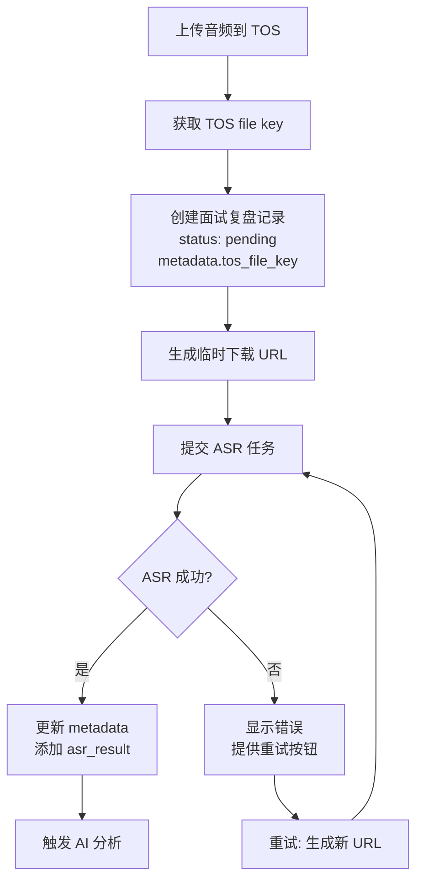

# Change: 重构面试复盘创建流程 - 基于 TOS 文件而非 ASR 任务

## Why

当前面试复盘创建流程要求 ASR 任务完成后才能创建记录，导致以下问题：
1. ASR 失败时报错 `ASR error: status=45000000, message=[Client-side generic error] OperatorWrapper Process failed: cannot find task`
2. ASR 失败后无法重试，因为没有保存原始音频文件信息
3. TOS 临时 URL 过期后，ASR 任务无法恢复

通过在 TOS 上传完成后立即创建面试复盘记录，并存储 TOS 文件 key，可以：
- 支持 ASR 失败重试（使用文件 key 生成新的临时 URL）
- 解耦文件上传和 ASR 处理流程
- 提高系统容错性

## What Changes

### Backend Changes
- **BREAKING** `CreateReview` API 改为接收 `tos_file_key` 而非 `main_audio_id`（ASR task ID）
- `CreateInterviewReview` service 不再验证 ASR 任务，改为接收 TOS 文件信息
- 新增 `RetryASR` API 端点，支持使用存储的 TOS key 重新提交 ASR 任务
- metadata 结构变更：新增 `tos_file_key` 字段，`main_audio_id` 改为存储 ASR task ID（可选）

### Frontend Changes
- Step 1 (上传音频) 完成后立即调用 `createReview` API 创建记录
- Step 2 (语音识别) 改为在已有记录上触发 ASR，完成后更新 metadata
- 新增 ASR 重试功能：获取新的 TOS 下载 URL，重新提交 ASR 任务
- 创建流程支持从任意步骤恢复（页面刷新后可继续）

### Data Flow Change

## Impact

- **Affected specs**: interview-review-ui (修改创建流程要求)
- **Affected code**:
  - Backend: `server/api/interview/interview.go`, `server/service/interview/interview_service.go`
  - Frontend: `web/src/pages/interview/InterviewReviewDetail.tsx`, `web/src/api/interview.ts`, `web/src/types/interview.ts`
- **Breaking changes**: 
  - `POST /api/interview/reviews` 请求体结构变更
  - 不向后兼容旧的面试复盘记录
